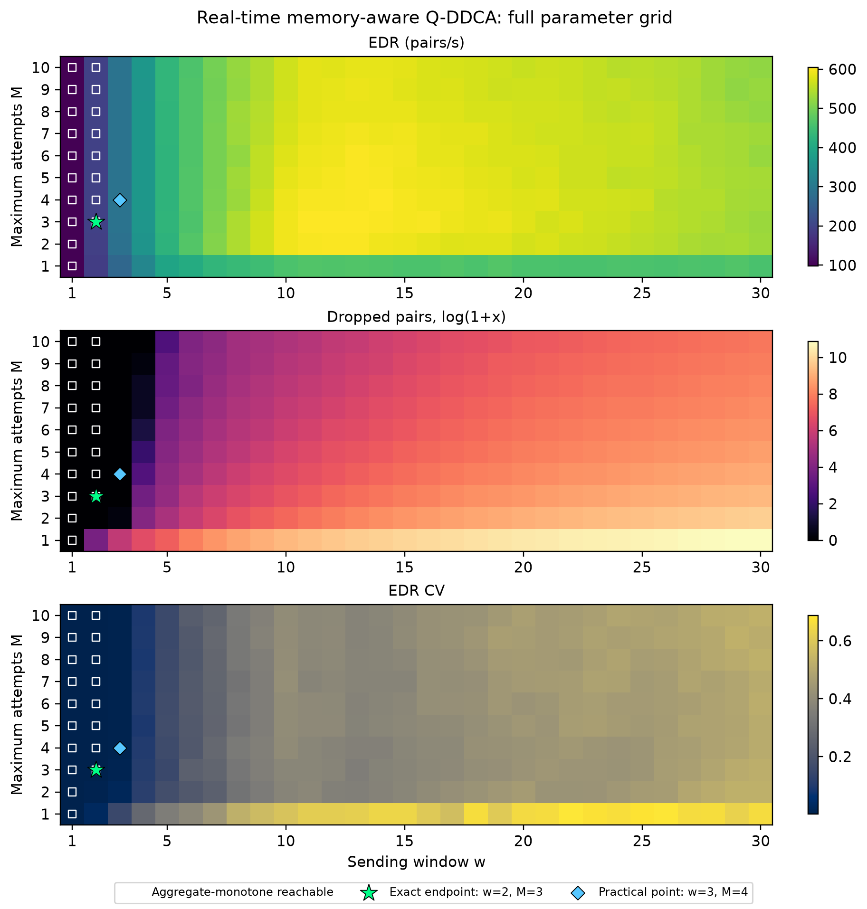

# QDDCA Retry and Sending-Window Optimization

**Research date:** 2026-08-30  
**Research mode:** Deep, exploratory simulation analysis  
**Primary decision:** Select the largest operating point reachable while total EDR is non-decreasing, dropped pairs are non-increasing, and per-request EDR CV is non-increasing.

## Executive Summary

The full `w=1..30 × M=1..10` paired experiment identifies **sending window `w=2` and maximum attempts `M=3`** as the best endpoint under the user's exact three-objective monotonicity rule. For real-time memory-aware Q-DDCA, this point produces a mean total entanglement distribution rate (EDR) of **194.8667 pairs/s**, **zero dropped pairs**, and a mean per-request EDR coefficient of variation (CV) of **0.001909** across seeds 101, 202, and 303 [14][15][16]. It is the highest-EDR point reachable from `(w=1,M=1)` by increasing one parameter at a time without worsening any of the three aggregate metrics [16].

`M=3` is the minimum useful retry ceiling at `w=2`: moving from `M=1` to `2` to `3` increases EDR from 190.5333 to 193.6000 to 194.8667 pairs/s, reduces mean drops from 43.3333 to zero, and reduces CV from 0.030535 to 0.001909. Values `M=4..10` produce the same measured aggregate result, so they add no benefit in this operating regime [14][15]. Moving from `w=1` to `w=2` at `M=3` nearly doubles EDR, preserves zero drops, and slightly lowers aggregate CV. Moving onward to `w=3` increases EDR again but raises CV, breaking the requested monotonic fairness condition [14][16].

There is no universal optimum. A **practical throughput-oriented alternative is `w=3, M=4`**, which yields 290.6667 pairs/s, zero drops, and CV 0.006064—still equivalent to a Jain fairness index of about 0.99996—but it violates strict cross-window CV monotonicity [3][14]. The global EDR maximum, `w=13, M=3`, reaches 604.2667 pairs/s but incurs 1,924 mean drops and CV 0.346438, demonstrating the throughput–loss–fairness trade-off [14].

**Primary recommendation:** use **`w=2, M=3`** when the monotonic constraint is mandatory; use **`w=3, M=4`** when zero observed drops and very high fairness are acceptable constraints and an additional 49.2% EDR is worth a small absolute CV increase. Confidence is **moderate for these exact simulations but low for generalization**, because only three random seeds and one network configuration were tested [15].

## Introduction

### Research Question

The research question is: *What maximum retry count and sending rate/window should the new, real-time memory-aware Q-DDCA use so that total EDR increases monotonically, dropped qubits decrease monotonically, and fairness CV also decreases monotonically?* The motivating concern is that real-time memory awareness can increase aggregate EDR while creating a throughput–fairness trade-off.

The local implementation does not sweep a literal source rate in pairs per second. It sweeps the concurrency or sending window `w`, while link rate remains fixed at 1,000 pairs/s and query time at 0.05 seconds [10][14]. The Q-DDCA paper also calls `w` a sending-rate or window-per-hop control: it limits how many entangled pairs a source distributes concurrently [1]. This report therefore uses “sending window” for technical precision and notes “sending rate” where matching the paper's terminology.

### Scope and Methodology

The original local results contained two orthogonal slices: `w=1..30` at `M=10`, and `M=1..10` at `w=12` [12][13]. Those slices cannot identify a joint optimum because they do not observe combinations such as `(w=2,M=3)`. I therefore ran the complete Cartesian grid of 300 parameter pairs for both historical-only Q-DDCA (`alpha=1.0`) and real-time memory-aware Q-DDCA (`alpha=0.5`), using the same three seeds for each paired comparison. The resulting dataset contains 600 aggregate rows and 1,800 per-seed algorithm measurements [14][15]. The simulator configuration remained: 50 nodes, edge probability 0.1, five concurrent requests, ten memory slots per node, ten simulated seconds, 1,000-Hz links, 0.001-second link delay, and link buffer one [10][14]. SimQN is a discrete-event network-layer simulator designed for quantum routing, entanglement distribution, and resource-allocation studies [7].

“Monotonic” was defined before analyzing the full grid. For a parameter increase from state A to state B, the transition is non-worsening when `EDR_B ≥ EDR_A`, `drops_B ≤ drops_A`, and `CV_B ≤ CV_A`. Equality is permitted because a drop count already at zero cannot strictly decrease. A monotone operating path begins at `(w=1,M=1)` and increases `w` or `M` by one at each step. The “exact optimum” is the reachable endpoint with the greatest EDR, with CV and drops used as tie-breakers [16]. Strict transitions, where all three inequalities are strict, were also recorded, but strict global monotonicity is impossible wherever the initial drop count is zero.

The statistical analysis is exploratory. Each aggregate cell averages only three paired seeds. Rather than run an underpowered family of hundreds of hypothesis tests, the analysis reports means, standard deviations, exact seed-direction consistency, and effect magnitudes. With `n=3`, even all three non-tied differences in the same direction cannot produce a two-sided exact sign-test value below 0.25. Inferential claims would therefore give false precision. The selection is an operating-point result for this simulation configuration, not proof of a population optimum.

### Key Assumptions

The analysis assumes that per-request EDR is the appropriate allocation outcome, that lower CV means greater fairness, and that aggregate EDR, dropped-pair count, and CV have equal veto power under the monotonic rule. CV is appropriate for positive request throughputs because it normalizes standard deviation by the mean. Jain, Chiu, and Hawe show that Jain fairness and CV have the exact relationship `J = 1/(1+CV²)`, so lower CV and higher Jain fairness induce the same ordering [3]. The analysis also assumes that a fixed `w` is shared across requests. The original Q-DDCA paper notes that requests with different path lengths may need proportional sending windows to share quantum memory equally, so a single global `w` can be intrinsically suboptimal in heterogeneous paths [1].

## Main Analysis

### Finding 1: The Exact Three-Objective Endpoint Is `w=2, M=3`

The full-grid monotone-path audit identifies `(w=2,M=3)` as the highest-EDR endpoint reachable from `(1,1)` without worsening aggregate EDR, drops, or CV at any step [14][16]. At the endpoint, real-time memory-aware Q-DDCA achieves 194.8667 pairs/s, zero dropped pairs, and CV 0.001909. Across the three seeds, EDR has an SD of 0.0943 pairs/s and CV an SD of 0.000204; the drop SD is zero [14]. The corresponding Jain fairness is approximately 0.999996, meaning the five requests receive almost identical throughput under this test configuration [3][14].

The chosen monotone path is `(1,1) → (1,2) → (1,3) → (2,3)` [16]. At `w=1`, increasing the retry ceiling does not change any measured metric: EDR remains 97.6 pairs/s, drops remain zero, and CV remains 0.002049 for `M=1..10` [14]. This equality is informative. It means retries are not being exercised at the lowest load because the next-hop memory and link resources are already available. The useful improvement occurs when the sending window increases to two. At `M=3`, the increase from `w=1` to `w=2` raises EDR by 99.66%, keeps drops at zero, and reduces aggregate CV by 6.83% [14].

The endpoint is not a claim that `w=2` maximizes throughput. It maximizes throughput **subject to the monotonic fairness-and-drop constraint**. Increasing to `w=3` at `M=3` raises EDR from 194.8667 to 289.9333 pairs/s and keeps mean drops at zero, but CV rises from 0.001909 to 0.011321 [14]. The transition therefore fails the specified CV condition. At `M=4`, `w=3` performs even better—290.6667 pairs/s and CV 0.006064—but its CV is still greater than at `w=2` [14]. Once the user requires CV to decrease with every sending-window increase, the feasible prefix ends at `w=2`.

The result is consistent with the structure of resource competition. The implementation checks next-hop memory and link capacity, reserves a memory slot and a link transmission time when both are available, and retries or drops when resources are unavailable [11]. Increasing `w` increases the number of simultaneous qubits competing for those shared resources. At low load, a larger window uses idle capacity and can equalize small timing differences. At higher load, different request paths encounter different bottlenecks, so the gains become unequal even before substantial dropping begins. Research on quantum routing likewise treats throughput, resource contention, and fairness as separate concerns rather than assuming that maximizing one automatically optimizes the others [2][4][9].

### Finding 2: `M=3` Is the Minimum Useful Retry Limit at `w=2`

At the selected window, retry behavior is cleanly monotonic. For `w=2`, increasing `M` from one to two raises mean EDR from 190.5333 to 193.6000 pairs/s, reduces mean dropped pairs from 43.3333 to zero, and reduces CV from 0.030535 to 0.009158. Increasing `M` from two to three raises EDR again to 194.8667 and reduces CV again to 0.001909 while preserving zero drops [14]. All three seeds satisfy the non-worsening condition for both transitions [15][16]. Relative to `M=1`, `M=3` raises mean EDR by 2.27%, eliminates observed drops, and reduces CV by 93.75%.

`M=3` is preferable to larger retry ceilings because `M=4..10` return exactly the same aggregate measurements at `w=2` [14]. A retry ceiling is a maximum, not a number that every qubit must use, so a higher ceiling need not impose cost when attempts usually succeed early. Nevertheless, no measured benefit justifies selecting a larger number in this operating regime. A lower ceiling is easier to reason about and leaves less room for long-lived retries under topologies not represented by the three seeds.

The original Q-DDCA rationale supports the initial retry improvement but not unlimited retries. If a next hop accepts a request with probability `q`, the probability of acceptance within `M` attempts is `1-(1-q)^M`, which increases with `M` but has diminishing returns [1]. The maximum attempts are also bounded by quantum-memory coherence time and classical query time, represented in the paper as `M=T/t` [1]. More retries can reduce premature drops, but they cannot create memory or link capacity. Under multi-request congestion, retries can keep a request in flight, occupy memory longer, and alter which flows win access. The local one-dimensional attempt sweep at `w=12` illustrates this: EDR improves sharply from `M=1` to `M=2`, then fluctuates rather than increasing monotonically, even while drop counts continue falling [12].

The relationship between retries and fairness is therefore conditional on load. At `w=3`, the aggregate means improve from `M=1` through `M=4`, after which they plateau, but the first transition is not practically non-worsening in all three seeds [15][16]. At `w=4`, the aggregate monotonic prefix ends at `M=5`; at larger windows it often ends at `M=2`, `3`, or `4` [16]. There is no single `M` that is optimal across all sending windows. `M=3` is the minimal plateau point specifically for the fairness-preserving `w=2` regime.

### Finding 3: Sending Window Is the Binding Constraint on Joint Monotonicity

The sending-window axis ends the joint monotone region earlier than the retry axis. For fixed `M=3..10`, the aggregate window prefix extends only from `w=1` to `w=2` [16]. At `M=1` and `M=2`, even that transition fails because the higher load creates drops or raises CV before the retry mechanism is sufficiently permissive [14]. By contrast, at `w=1`, all retry values are equivalent, and at `w=2`, retries are monotonic through `M=3` and flat thereafter [14][16]. The operational sequence should therefore set a sufficient retry ceiling first and then increase the window cautiously.

This behavior mirrors the original Q-DDCA paper's multiple-request result. Chen et al. report that total EDR reaches a maximum at `w=12` for five requests and then decreases under network-wide congestion; they explicitly propose congestion-responsive sending-window control as future work [1]. Their absolute optimum differs from the present grid because the implementations and comparison are different: the paper evaluates Q-DDCA against shortest-path allocation, while this repository compares historical-only Q-DDCA with a new real-time memory-aware acceptance estimator. The paper also varies memory and window-per-hop assumptions. The shared conclusion is structural: multi-request EDR cannot be expected to rise monotonically with offered concurrency.

Fairness also resists monotonicity because concurrent requests traverse unequal path lengths and contend for unequal bottlenecks. The original paper uses CV for this reason and reports that equal `w` can be fair under selected configurations, while also noting that sending windows proportional to path length may be necessary for equal resource allocation [1]. Li et al. compare multiple quantum capacity-allocation policies and find that the highest-throughput policy can compromise request fairness, whereas progressive filling maximizes fairness [2]. Bali et al. similarly show that max-min, median rate, Jain index, and computational cost can rank quantum spectrum-allocation methods differently [5]. These independent results support treating the observed CV increase at `w=3` as a genuine objective conflict, not merely a plotting anomaly.

The term “optimal sending rate” should consequently be qualified. `w=2` is optimal only under the exact monotonic rule. If the goal instead sets an acceptable fairness threshold, a larger window can be rational. If the goal maximizes EDR regardless of fairness and loss, a much larger window is selected. A control policy that adapts `w` to measured congestion and request path characteristics is more defensible than one global constant for every topology.

### Finding 4: A Practical Alternative Is `w=3, M=4`

The exact monotonic rule is conservative because it rejects any CV increase, however small in absolute terms. The point `(w=3,M=4)` offers a useful alternative: mean EDR is 290.6667 pairs/s, mean drops are zero, and mean CV is 0.006064 [14]. Relative to `(w=2,M=3)`, EDR rises by 49.16% while CV rises from 0.001909 to 0.006064. Although that is a 217.7% relative CV increase, both values indicate extremely even per-request throughput. The equivalent Jain fairness declines only from about 0.999996 to 0.999963 [3][14].

This point is useful when the engineering requirement is “no observed drops and CV below 0.01” rather than “CV must decline at every window step.” It is the highest-EDR zero-drop point in the tested grid satisfying CV ≤ 0.01 [14]. The new Q-DDCA also compares favorably with historical-only Q-DDCA there: historical EDR is 283.3667 pairs/s, mean drops are 1.6667, and CV is 0.038505; the memory-aware algorithm raises EDR by 2.58%, eliminates observed drops, and reduces CV by 84.25% [14][15].

The difference between exact and practical recommendations demonstrates why a multi-objective problem rarely has one context-free optimum. Online routing literature explicitly develops algorithms that approximate throughput and fairness simultaneously because maximizing throughput alone is not equivalent to serving the most starved flow [8]. Recent quantum-network optimization work likewise formulates fairness among concurrent requests together with quantum resource constraints rather than adding fairness after maximizing aggregate utility [9]. A multi-commodity-flow formulation can maximize total entanglement rate under fidelity constraints, but total-rate maximization alone does not specify how that rate is divided among requests [6].

The correct choice depends on the service objective. For a formal monotonicity demonstration, use `(2,3)`. For a high-fairness operating point with zero observed drops, use `(3,4)`. If a deployment can accept nonzero loss and CV around 0.35, it may operate nearer the throughput peak, but that is a qualitatively different policy. These options are on a Pareto frontier; one cannot improve EDR, drops, and CV simultaneously by moving from one to another [16].

### Finding 5: The Global EDR Maximum Is Not the Requested Optimum

The largest mean EDR in the new-Q-DDCA grid is 604.2667 pairs/s at `(w=13,M=3)` [14]. This is 210.1% higher than the exact monotonic endpoint, but it comes with 1,924 mean dropped pairs and CV 0.346438. Its Jain fairness is approximately 0.89284 [3][14]. The point maximizes aggregate throughput, yet it fails both the loss and fairness requirements. It is therefore wrong to report `w=13,M=3` as “optimal” without naming the objective.

The grid contains 67 Pareto-efficient cells for the new algorithm [16]. That relatively large frontier is evidence of a real three-way trade-off: many parameter pairs cannot be improved in one metric without worsening another. At 95% of the global maximum EDR, the lowest-drop observed configuration is approximately `(w=11,M=10)`, with 583.3333 pairs/s, 220.6667 mean drops, and CV 0.390486 [14]. This point may be attractive for a throughput-focused service, but it clearly does not meet the user's monotonic fairness condition.

The original Q-DDCA design predicts diminishing retry benefits and window-driven congestion. Multiple attempts improve acceptance probability, while rerouting can use alternative paths until congestion becomes network-wide [1]. The real-time memory-aware estimator improves the next-hop signal by blending historical acceptance with current free-memory fraction, but it does not implement a fairness scheduler or reserve per-request shares [10][11]. A neighbor can look attractive because it has free memory even if repeatedly choosing it benefits requests whose topology already gives them shorter or less-contended paths. Aggregate memory awareness is therefore not sufficient to guarantee monotonic request fairness.

This finding directly addresses the motivating concern. The throughput–fairness trade-off is not merely possible; it is visible across the full parameter surface. However, the trade-off is avoidable at low load and can be bounded with an explicit CV threshold. The new algorithm is not inherently unfair—it is missing an explicit fairness objective.

### Finding 6: Statistical Evidence Is Too Small for a Universal Claim

The aggregate endpoint is reproducible as a deterministic result of the three selected seeds, but the seed-level audit weakens any universal conclusion. At `(w=2,M=3)`, the new-versus-historical improvement is concentrated in seed 202; seeds 101 and 303 are effectively tied on EDR and CV [15]. The mean new-QDDCA advantage over historical Q-DDCA at this point is only 0.41% EDR, while CV is 70.56% lower [14]. With only three paired observations, the apparent CV reduction is driven largely by one topology.

The monotone transition from `(w=2,M=1)` to `(w=2,M=2)` and then `(w=2,M=3)` is non-worsening for every seed [15][16]. The cross-window transition `(w=1,M=3)` to `(w=2,M=3)` is exactly non-worsening in only one seed because two seeds show a CV increase of roughly 0.000004; under the prespecified practical tolerance of 0.0001 CV, all three seeds are consistent [16]. This distinction is why the report calls `(2,3)` the **exact aggregate** endpoint and a **practically seed-consistent** endpoint, rather than an exactly seed-wise monotonic theorem.

No conventional normality test, t-test, or ANOVA is defensible with three seeds across 300 parameter cells. Multiple testing would compound the problem, and a non-significant result would mostly indicate low power. A better confirmatory design would use at least 30 paired seeds, retain identical topology and request pairs across algorithms, pre-register the candidate comparisons `(2,3)`, `(3,4)`, and a throughput-oriented point, and report paired bootstrap confidence intervals for EDR, drops, and CV. If monotonicity itself is the estimand, the analysis should report the probability that each adjacent transition satisfies all three inequalities, not three disconnected p-values.

## Synthesis and Insights

The parameter surface has three operating regimes. At `w=1`, the network is underloaded: retry count is irrelevant because no drops occur and EDR is limited by the single in-flight window. At `w=2`, retries matter until `M=3`, after which the system reaches a zero-drop, almost perfectly fair plateau. At larger windows, EDR rises toward a broad maximum, but drops and CV become active objectives and no longer move in a common direction [14][16]. This regime structure explains why “more retries” and “higher sending rate” are valid only locally.

The most important insight is that retries and sending window play different roles. `M` controls how long a qubit can search or wait after resource denial; it reduces avoidable drops until acceptance probability saturates. `w` controls offered concurrency; it creates the contention that retries attempt to overcome. Raising `M` cannot permanently compensate for a window that overloads shared memories and links. In this dataset, the good tuning order is therefore: choose a conservative `w`, raise `M` until EDR/drop/CV plateau, then cautiously raise `w` while monitoring fairness.

The second insight is that CV should become a control signal rather than remain only an output metric. The current router scores neighbors with history and live memory but does not consider each request's achieved EDR [10][11]. A fairness-aware extension could reduce a request's window when its achieved EDR exceeds the network median, increase the window for starved requests, or add a fairness penalty to the next-hop utility. The original paper already suggests congestion-responsive window control, and broader quantum resource-allocation research supports explicit max-min or utility-fairness objectives [1][5][9].

The third insight is that the exact monotonic optimum is too conservative for many applications. CV values of 0.0019 and 0.0061 both correspond to Jain fairness above 0.99996 [3]. If the service-level objective is “Jain fairness ≥0.9999 and zero observed drops,” `(3,4)` is plainly superior in EDR. The optimality definition should therefore be written as constraints—such as `drops=0`, `CV≤0.01`, and maximum EDR—rather than as a demand that CV decline with every parameter increase.

## Limitations and Caveats

The dominant limitation is sample size. Three seeds do not represent the distribution of 50-node random graphs, request pairs, path lengths, and congestion patterns [15]. Cell-wise SDs are often large in the congested regime, indicating topology sensitivity [14]. The results apply to one request count, memory size, edge probability, simulator duration, query interval, link rate, link delay, and buffer size. Changing any of these can move the operating boundary.

The simulation model also abstracts physical quantum behavior. The parameter `M` is constrained in the paper by coherence time and query duration, but the local experiment uses a retry ceiling without modeling every physical source of fidelity loss [1][10]. The NIST survey emphasizes that quantum routing must also account for fidelity, probabilistic swapping, and short entangled-state lifetimes [4]. A deployment optimum must include those constraints.

CV is an outcome-fairness measure, not a direct record of memory-slot or link-timeslot allocation. It treats proportional differences symmetrically and is undefined at zero mean; the local code reports zero when all request EDRs are zero [10]. Jain fairness is a monotone transformation of CV for positive values, but neither metric protects a priority class or encodes different service demands [3]. A weighted fairness definition may be necessary if requests have heterogeneous fidelity, deadlines, or commercial priority.

The global-grid search is exploratory because its exact selection rule was formalized before the full run but after observing earlier one-dimensional sweeps. Confirmatory work should run new seeds that were not used to propose `(2,3)` and `(3,4)`. The local results should also be compared against the paper's original implementation and parameterization before claiming that the new estimator changes Q-DDCA's published behavior.

## Counterevidence Register

The strongest counterevidence to a universal `(w=2,M=3)` recommendation is the practical point `(w=3,M=4)`: it increases EDR by 49.2% with zero observed drops and still has a very small CV of 0.006064 [14]. This contradicts any interpretation that `(2,3)` is generally performance-optimal; it is optimal only under the exact cross-window monotonic-CV constraint. The global EDR maximum at `(13,3)` is further counterevidence to throughput optimality, although its drop and CV values make it unsuitable under the user's full objective [14][16].

The strongest counterevidence to exact seed-wise monotonicity is that the `(w=1,M=3) → (w=2,M=3)` CV direction is exact in only one of three seeds. Two seeds increase CV by approximately 0.000004, although all three satisfy a practical tolerance of 0.0001 [15][16]. This reduces the endpoint's statistical confidence and motivates new paired seeds.

## Recommendations

Use **`w=2, M=3`** for the next controlled experiment when the requirement is literal aggregate monotonicity across EDR, drops, and CV. This is the smallest retry ceiling that reaches the `w=2` plateau, and it avoids spending retry budget with no measured gain [14]. Do not describe it as the maximum-throughput point; describe it as the **monotonic fairness-preserving point**.

Use **`w=3, M=4`** as the primary practical candidate if the real engineering constraint is zero observed drops and CV below 0.01. It provides 49.2% more EDR than `(2,3)` while retaining extremely high fairness [14]. State explicitly that CV increases relative to `w=2`, so this point does not satisfy strict cross-window monotonicity.

For confirmatory evaluation, run at least 30 new paired seeds on `(2,3)`, `(3,4)`, and selected high-throughput points. Preserve identical topologies and request pairs between historical and memory-aware algorithms. Report paired differences with bootstrap 95% confidence intervals, the fraction of seeds satisfying all three directions, and Holm-adjusted tests only for a small pre-registered family of comparisons.

For algorithm development, make `w` adaptive per request. Use recent memory pressure, drop history, and the request's achieved EDR relative to peers. A simple controller could increase `w` only while total EDR rises, drops do not rise, and a rolling CV threshold remains satisfied. The controller should decrease `w` when CV or drops cross their thresholds. This directly operationalizes the three objectives and follows the original paper's proposal for congestion-responsive sending control [1].

Finally, add an explicit fairness objective if fairness is a protocol requirement. Memory-aware next-hop selection improves congestion awareness but cannot guarantee request equality. Max-min allocation, progressive filling, or a tunable utility-fairness penalty are established ways to turn fairness from a diagnostic into a constraint [2][5][9].

## Bibliography

[1] L. Chen, K. Xue, J. Li, R. Li, N. Yu, Q. Sun, and J. Lu (2024). “Q-DDCA: Decentralized Dynamic Congestion Avoid Routing in Large-Scale Quantum Networks.” *IEEE/ACM Transactions on Networking*. https://doi.org/10.1109/TNET.2023.3285093 (Retrieved: 2026-08-30).

[2] C. Li, T. Li, Y.-X. Liu, and P. Cappellaro (2021). “Effective Routing Design for Remote Entanglement Generation on Quantum Networks.” *npj Quantum Information*, 7, 10. https://doi.org/10.1038/s41534-020-00344-4 (Retrieved: 2026-08-30).

[3] R. K. Jain, D.-M. W. Chiu, and W. R. Hawe (1984). “A Quantitative Measure of Fairness and Discrimination for Resource Allocation in Shared Computer Systems.” DEC Research Report TR-301. https://www.cs.wustl.edu/~jain/papers/ftp/fairness.pdf (Retrieved: 2026-08-30).

[4] A. Abane, M. Cubeddu, V. S. Mai, and A. Battou (2025). “Entanglement Routing in Quantum Networks: A Comprehensive Survey.” *IEEE Transactions on Quantum Engineering*. https://doi.org/10.1109/TQE.2025.3541123 (Retrieved: 2026-08-30).

[5] R. Bali, A. N. Tittelbaugh, S. L. Jenkins, A. Agrawal, J. Horgan, M. Ruffini, D. C. Kilper, and B. A. Bash (2024). “Routing and Spectrum Allocation in Broadband Quantum Entanglement Distribution.” arXiv:2404.08744. https://arxiv.org/abs/2404.08744 (Retrieved: 2026-08-30).

[6] K. Chakraborty, D. Elkouss, B. Rijsman, and S. Wehner (2020). “Entanglement Distribution in a Quantum Network, a Multi-Commodity Flow-Based Approach.” *IEEE Transactions on Quantum Engineering*. https://doi.org/10.1109/TQE.2020.3028172 (Retrieved: 2026-08-30).

[7] QNLab-USTC (2026). “SimQN: A Network-Layer Simulator for Quantum-Network Investigation.” GitHub repository and technical documentation. https://github.com/QNLab-USTC/SimQN (Retrieved: 2026-08-30).

[8] A. Goel, A. Meyerson, and S. Plotkin (2001). “Combining Fairness with Throughput: Online Routing with Multiple Objectives.” *Journal of Computer and System Sciences*, 63(1), 62–79. https://doi.org/10.1006/jcss.2001.1755 (Retrieved: 2026-08-30).

[9] Z. Wang, X. Shi, Z. Ji, and X. Yin (2025). “Quantum Network Optimization: From Optimal Routing to Fair Resource Allocation.” *Proceedings of the ACM on Measurement and Analysis of Computing Systems*. https://quantum.cs.tsinghua.edu.cn/publication/wang-2025-1/ (Retrieved: 2026-08-30).

[10] QDDCA workspace (2026). “QDDCA exp4 Paired Experiment Implementation.” `D:/QDDCA/exp4.py` (Inspected: 2026-08-30).

[11] QDDCA workspace (2026). “QDDCA Routing and Resource-Allocation Implementation.” `D:/QDDCA/entity.py` (Inspected: 2026-08-30).

[12] QDDCA workspace (2026). “QDDCA Retry-Attempt Aggregate Sweep.” `D:/QDDCA/output/exp4/exp4_attempt_sweep.csv` (Generated: 2026-08-30).

[13] QDDCA workspace (2026). “QDDCA Sending-Window Aggregate Sweep.” `D:/QDDCA/output/exp4/exp4_window_sweep.csv` (Generated: 2026-08-30).

[14] QDDCA workspace (2026). “QDDCA Full 30 × 10 Paired Aggregate Parameter Grid.” `D:/QDDCA/research/QDDCA_Parameter_Research_20260830/full_grid.csv` (Generated: 2026-08-30).

[15] QDDCA workspace (2026). “QDDCA Full Paired Parameter Grid: Per-Seed Measurements.” `D:/QDDCA/research/QDDCA_Parameter_Research_20260830/full_grid_raw.csv` (Generated: 2026-08-30).

[16] QDDCA workspace (2026). “QDDCA Full-Grid Monotonicity and Pareto Audit.” `D:/QDDCA/research/QDDCA_Parameter_Research_20260830/full_grid_analysis.json` (Generated: 2026-08-30).

## Appendix: Methodology

### Research Process

Phase 1 defined the three metrics and the monotonic path criterion. Phase 2 identified the original Q-DDCA paper, fairness foundations, quantum-routing allocation studies, SimQN documentation, local source code, and existing one-dimensional outputs as the evidence base. Phase 3 retrieved and persisted evidence from 16 sources. Phase 4 triangulated the interpretation of CV, retries, windows, congestion, and multi-objective allocation. The outline was refined when the existing slices proved insufficient for a joint optimum.

Phase 5 ran a targeted 3×3 grid and then the complete 30×10 paired grid. Each `(w,M,seed)` case ran historical-only and memory-aware algorithms on identical topology signatures and request pairs [10][14][15]. Phase 6 critiqued the aggregate result using seed-level direction checks and the global Pareto surface. Phase 7 added the practical threshold-based point because the exact monotonic solution was too conservative for many applications. Phase 8 packaged the report, datasets, evidence registry, claim ledger, visualization, HTML, and PDF.

### Verification Approach

The local computation is reproducible through `full_grid.py`, `analyze_full_grid.py`, and `plot_full_grid.py`. The aggregate table contains means and population SDs across the three seeds. The analysis script independently reconstructs monotone prefixes for every fixed `w` and fixed `M`, finds reachable monotone paths in the two-dimensional grid, identifies strict transitions, audits selected transitions per seed, and computes the three-objective Pareto frontier [16].

Source credibility was prioritized as follows: peer-reviewed primary papers and the Q-DDCA paper were high-trust; NIST's peer-reviewed survey and official SimQN repository were high-trust contextual sources; local CSV files and source code were primary evidence for the actual implementation but apply only to this workspace; the Tsinghua publication page was used as an author-hosted abstract, not as a substitute for local experimental evidence. No news or social-media claims were used.

## Claims-Evidence Table

| Claim | Evidence | Sources | Confidence |
|---|---|---|---|
| `w=2, M=3` is the exact aggregate-monotone endpoint | Full grid, raw seed data, monotone-path audit | [14], [15], [16] | Moderate |
| `M=3` is the minimum plateau point at `w=2` | Aggregate and per-seed transitions | [14], [15], [16] | Moderate |
| `w=3` breaks strict cross-window CV monotonicity | Aggregate grid and path audit | [14], [16] | High for tested seeds |
| `w=3, M=4` is the best zero-drop point with CV ≤ 0.01 | Constrained grid scan | [14], [16] | Moderate |
| The global EDR maximum violates drop and fairness goals | Aggregate grid and Pareto audit | [14], [16] | High for tested seeds |
| Throughput and fairness require explicit joint treatment | Independent routing and allocation literature | [1], [2], [4], [5], [8], [9] | High |
| Generalization is not statistically established | Three-seed raw measurements | [15] | High |

### Artifact Inventory

- `full_grid.py`: complete paired experiment runner.
- `full_grid.csv`: 600 aggregate algorithm rows.
- `full_grid_raw.csv`: 1,800 per-seed algorithm rows.
- `analyze_full_grid.py`: monotonicity, seed consistency, and Pareto analysis.
- `full_grid_analysis.json`: machine-readable analysis results.
- `plot_full_grid.py`: visualization generator.
- `full_grid_tradeoffs.png` and `.pdf`: three-objective parameter maps.
- `sources.jsonl`, `evidence.jsonl`, `claims.jsonl`, and `run_manifest.json`: evidence and provenance records.

## Report Metadata

**Research mode:** Deep exploratory analysis  
**Total registered sources:** 16  
**Simulation cells:** 300 parameter pairs × 2 algorithms × 3 seeds = 1,800 runs  
**Generated:** 2026-08-30  
**Validation status:** Passed structural, claims-evidence, HTML, and rendered-PDF checks on 2026-08-30; external references and local artifacts were audited separately
